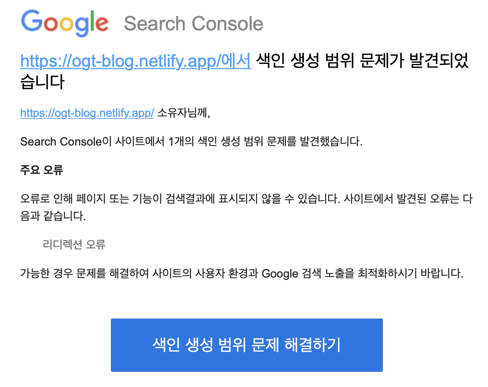

저는 이번에 제가 블로그를 만든 후 google search console에 블로그가 등록되지 않는 이슈를 해결한 과정을 공유해보려고 합니다.

앞으로 google search console 라고 쓰면 너무 길어지니 GSC라고 부르겠습니다.

저는 블로그를 만든 후 6개월간 해당 사이트가 구글에 등록되지 않았습니다. 그래서 왜 그럴까 계속 찾아보던 중 GSC에서 URL 검사를 해본 결과 URL이 구글에 등록되어 있지 않다는 메시지를 발견할 수 있었고, 그 아래에 있는 색인 생성 요청을 눌렀습니다.
그리고 몇일 뒤 GSC에서 저에게 메일이 한통 왔습니다.



내용은 저의 블로그 인덱스에 접근했을 때 블로그가 리디렉션이 되어 URL을 등록할 수 없다는 것이였습니다.
그래서 저는 저의 블로그에 접속해서 어떤일이 일어나는지 확인해봤습니다.
인덱스에 접근했을때 크롬 네트워크탭에서 확인해본 결과 작성된 html과 함께 상태값이 304가 전달되었습니다.


304의 상태값을 검색해보니 인덱스 html이 캐싱되어 있어 리소스를 재전송 할 필요가 없다는 것이였습니다.

> 클라이언트 리디렉션 응답 코드 304 Not Modified는 요청된 리소스를 재전송할 필요가 없음을 나타낸다.<br/>
> 캐시된 자원으로의 암묵적인 리디렉션이다.

그래서 저는 html을 캐싱하지 않도록 설정하기 위해 Netlify Dosc를 찾아봤습니다.
저는 해결방법을 [여기서](https://docs.netlify.com/routing/headers/#multi-value-headers) 찾을 수 있었습니다.

# Netlify Custom Header

우선 netlify.toml라는 파일을 root directory에 생성합니다.

```
[[headers]]
  for = "/*"
  [headers.values]
  cache-control = '''
  max-age=0,
  no-cache,
  no-store,
  must-revalidate'''
```

## 코드 설명

- for: 해당 블로그의 모든 url에 아래의 설정 적용
- cache-control: 브라우저 캐싱에 대한 설정값
- max-age: 리소스가 최신 상태라고 판단할 최대 시간을 지정합니다. (캐싱을 하지 않아 0초)
- no-cache: 캐싱을 하지 않음
- no-store: 캐시는 클라이언트 요청 혹은 서버 응답에 관해서 어떤 것도 저장해서는 안됩니다.
- must-revalidate: 캐시는 사용하기 이전에 기존 리소스의 상태를 반드시 확인해야 하며 만료된 리소스는 사용되어서는 안됩니다.

netlify.toml파일에 위와 같이 코드를 작성 후 배포를 해줍니다. 배포 후 빌드가 다 되면 이제 캐싱이 되지 않고 접근할 때 마다 상태값 200을 전달해줍니다. 이것까지 확인 후에 GSC에서 URL검사를 다시 한 후에 색인요청을 요청했습니다. 몇일 뒤에 저의 블로그의 URL이 GSC에 등록되었습니다.

;

# 마무리

저는 저의 블로그가 구글 SEO에서 접근하지 못하는 이유가 사이트맵에 문제가 있어서 그런줄 알고 그것에 대해서만 디버깅을 해왔습니다.
혹시 GSC에 사이트를 등록했고, 사이트맵을 등록했을 때 "사이트맵을 읽을 수 없음"이라고 나와서 사이트맵이 문제인가 라고 고민하시는 분들께 도움이 됬으면 좋겠습니다!
