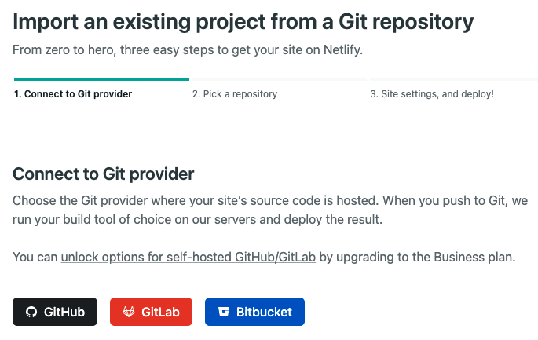

이번에는 Netlify를 이용하여 Gatsbyjs 프로젝트 호스팅하는 방법에 대해 작성하겠습니다.

Gatsbyjs프로젝트를 생성하지 못하신분은 이전 게시글을 보고와주세요!

[[Gatsbyjs] Gatsbyjs 프로젝트를 만들어보자!](https://ogt-blog.netlify.app/Gatsbyjs/1)

# Netlify란?

Netlify는 우선 무료호스팅, HTTPS제공, 프로젝트 자동배포 등 많은 기능을 재공하는 서비스입니다.

Github, GitLab 등등의 저장소에서 프로젝트의 코드를 배포하면 Netlify서버에서 빌드해서 자동으로 배포까지 해줍니다.

# Netlify 가입하기

[Netlify 사이트](https://www.netlify.com/)

1. 우선 Netlify 사이트에 접속해 주세요.

2. Sign up을 눌러 로그인 페이지로 접속해주세요.

3. 해당 페이지에서 로그인할 저장소를 선택 후 가입해주세요.

# Github Repository 생성

저는 my-blog라는 Repository를 만들었습니다.

그럼 이전 게시글에서 만든 프로젝트를 이번에 만든 리포지토리에 올리겠습니다.

# Netlify 호스팅하기

깃허브 리포지토리 생성 및 Netlify 회원가입이 완료 되었다면 Netlify에서 사이트를 추가하겠습니다.

해당 페이지에서 Add new site > import an existing project을 클릭합니다.

호스팅할 프로젝트가 있는 저장소를 선택해주세요.

호스팅할 프로젝트를 선택해주세요.

만약 원하는 프로젝트가 없다면 위에 계정 클릭 후 Add another organization을 하면 팝업이 뜹니다.

only select repositories로 선택되어 있으신분들은 저기서 Select repositories에서 원하시는 프로젝트를 찾아 선택 후 save버튼을 누르면 프로젝트 선택 화면에서 해등 프로젝트가 나오게 됩니다.

이제 프로젝트를 선택합니다.

따로 셋팅하신 분들은 해당 셋팅에 맞게 설정 후 deploy 버튼을 눌러 사이트를 생성합니다.

프로젝트가 빌드되면 호스팅이 되어 이제 외부에서 해당 사이트에 접근이 가능해집니다.

# Netlify url 변경하기

하지만 저는 해당 url이 마음에 들지가 않습니다.

제가 원하는 url로 변경을 해보겠습니다.

해당 사이트에서 Site settings버튼을 눌러 사이트 설정페이지로 이동합니다.

설정페이지에서 Change site name을 누릅니다.

site name에 본인이 원하는 url을 작성합니다.

혹시 수정이 되지 않을 경우 site name 인풋에 문자를 복사해보세요.

이후에 save버튼을 누르면 적용이 완료됩니다!
